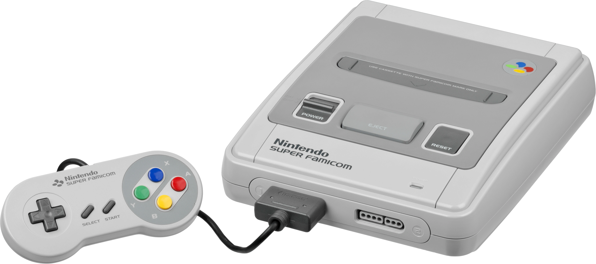

# snes-docs-ja

>**Warning**  
> このレポジトリは大半が執筆途中です。なので現在、ドキュメントとしての信頼性は皆無です。  
> また、コミット履歴は気まぐれで破壊されることがあります。

>**Note**  
> 断りがない限り、情報は全てNTSC版です。

スーパーファミコン(SFC)について、技術的な詳細を日本語でまとめたものです。

突然消えたり非公開にする可能性もあるので心配な方はクローンしておくことをお勧めします。

## コンテンツ一覧

### SNES

- [仕様](spec.md)
- [メモリマップ](memory/)
- [I/Oレジスタの一覧](ioreg.md)
- [乗算・除算](muldiv.md)
- [サイクル](cycle.md)
- [オープンバス](openbus.md)
- [割り込み](interrupt/)
    - [IRQ](interrupt/irq.md)
    - [レジスタ](interrupt/ioreg.md)

### CPU

- [レジスタ](65xx/register.md)
- [アドレッシング](65xx/addressing.md)
- [CPUサイクル](65xx/cycle.md)
- 命令セット
    - [データ転送命令](65xx/isa/transfer.md)
    - [ALU](65xx/isa/alu.md)
    - [回転・シフト命令](65xx/isa/rotate_shift.md)
    - [ジャンプ命令](65xx/isa/jump.md)
    - [制御命令](65xx/isa/control.md)

### メモリ

- [メモリマップ](memory/)
- [ウェイトステート2](memory/ws2.md)
- [WRAMへのレジスタ経由のアクセス](memory/wram.md)
- [DMA](memory/dma/)
    - [HDMA](memory/dma/hdma.md)
    - [レジスタ](memory/dma/ioreg.md)

### グラフィック

- [レイヤ](video/layer.md)
- [制御レジスタ](video/control.md)
- [背景(BG)](video/bg/)
    - [BGマップ](video/bg/bgmap.md)
    - [BG制御レジスタ](video/bg/control.md) 
    - [BGモード](video/bg/mode.md)
    - [モザイク](video/bg/mosaic.md)
    - [スクロール](video/bg/scroll.md)
- [スプライト(OBJ)](video/obj/)
    - [OAM](video/obj/oam.md)
    - [OAMへのレジスタ経由のアクセス](memory/oam.md)
    - [優先度](video/obj/priority.md)
    - [タイルサイズ](video/obj/obsel.md)
    - [ベースアドレス](video/obj/obsel.md)
- [VRAM](video/vram.md)
    - [タイルデータ](video/vram.md#-8x8タイルデータ-bg-and-obj)
    - [タイルマップ](video/bg/bgmap.md)
    - [VRAMへのレジスタ経由のアクセス](memory/vram.md)
- [パレット](video/palette.md)
    - [パレットへのレジスタ経由のアクセス](memory/palette.md)
    - [ダイレクトカラーモード](video/palette.md#ダイレクトカラーモード)
- [ウィンドウ](video/window.md)
- [カラーマス](video/colormath.md)
- [乗算](video/mul.md)
- [描画サイクル](video/scanline.md)
    - [Hカウンタ](video/scanline.md)
    - [Vカウンタ](video/scanline.md)

### サウンド

- [概要](sound/)
    - [レジスタ](sound/ioreg.md)
    - [SPC700](sound/spc700/)
        - [IOレジスタ](sound/spc700/ioreg.md)
        - [タイマー](sound/spc700/timer.md)

### カートリッジ

- [カートリッジヘッダ](cartridge/header.md)

### キー入力

- [キー入力](keypad/joypad.md)
- [キー入力(信号単位)](keypad/signal.md)

## リソース

- [snes-test-roms](https://github.com/pokemium/snes-test-roms)
- [Anomie's Docs](./others/anomie/)

## 関連するレポジトリ

- [gb-docs-ja](https://github.com/pokemium/gb-docs-ja): GameBoyについて
- [gba-docs-ja](https://github.com/pokemium/gba-docs-ja): GameBoy Advanceについて
- [nds-docs-ja](https://github.com/pokemium/nds-docs-ja): Nintendo DSについて

## 参考記事

- [Fullsnes - nocash SNES hardware specifications](https://problemkaputt.de/fullsnes.htm)
- [Wikipedia - スーパーファミコン](https://ja.wikipedia.org/wiki/%E3%82%B9%E3%83%BC%E3%83%91%E3%83%BC%E3%83%95%E3%82%A1%E3%83%9F%E3%82%B3%E3%83%B3)
