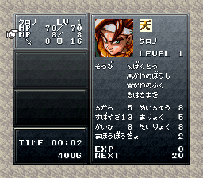
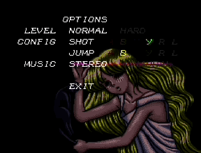

# HDMA

HDMA(HBlank DMA) は 各スキャンラインの HBlank<sup>[1](#fblank)</sup> でちょっとしたデータ転送<sup>[2](#hdma)</sup>を行い、PPUレジスタを書き換えて画面効果を実現するためのDMAです。

スキャンラインごとにPPUの内容を変更できるため、

- スキャンラインごとに色を設定することで、クロノトリガーのメニューのようなグラデーション塗りや、
- スキャンラインごとにウィンドウレジスタを変更することで、魔獣王のオプション画面のピンクのボーダー

といった画面効果を実現できます。

&nbsp;&nbsp;

HDMAのテーブルアドレスレジスタは [H-IRQ中](../../interrupt/irq.md) に変更できるため、うまく使えればより高度な画面効果も実現可能です。

## HDMAテーブル

HDMAテーブルは、どのデータをいつ転送する必要があるかについての指示を記したテーブルです。

```
  直接モード:
    1 byte   ヘッダ(リピートフラグ(bit7) & 転送行数)
      00h       HDMAテーブル終了 (until it restarts in next frame)
      01h..80h  1ユニット転送して、後の"X-01h"行だけ停止
      81h..FFh  "X-80h"行かけて、"X-80h"ユニット転送を行う (1行、1ユニット)
    N bytes  転送データ
      nを転送ユニットとすると、
        ヘッダが
          01h..80h: N = n バイト
          81h..FFh: N = (X-80h) * n バイト

    例(1ユニット=2バイト):
      $11           ; エントリ0
      $0000, $0000  ; 転送(y=n)

      $02           ; エントリ1
      $0100, $0040  ; 転送(y=n+17)

      $82           ; エントリ2
      $0104, $0041  ; 転送(y=n+19)
      $0108, $0042  ; 転送(y=n+20)

      $64           ; エントリ3
      $0114, $0045  ; 転送(y=n+21)

      $00           ; 終了(y=n+121)
```

間接モードのHDMAテーブルは、生データの代わりに、データへのポインタを含むようにします。

```
  間接モード:
    1 byte   ヘッダ (直接モードと同じ)
    2 bytes  Nバイトの転送データへのポインタ (ポインタが指すデータの内容は直接モードと同じ)

    例(1ユニット=2バイト):
      $11
      $E502 --> $0000, $0000 (y=n)

      $02
      $E506 --> $0100, $0040 (y=n+17)

      $82
      $E60E --> $0104, $0041 (y=n+19)
                $0108, $0042 (y=n+20)

      $64
      $E50A --> $0114, $0045 (y=n+21)

      $00                    (y=n+121)
```

転送データ数(`N`, GDMA) または 転送データへのポインタ(HDMA) の値は常にテーブルからREADされます。データ値は転送方向によって READ または WRITTEN になります。

HDMAでは、テーブル自体も間接的にアドレス指定されたデータブロックも、転送ステップは常にインクリメンタルです。

## リロード

`(H, V)=(6, 0)`のときに、アクティブなHDMAチャネルのHDMAレジスタに対して、リロードが起きます。

TODO

## 注釈

<sup id="fblank">1: 転送は FBlank中 でも実行されます。</sup>

<sup id="hdma">2: 1回のHBlankで、最大4バイトまでです。</sup>

