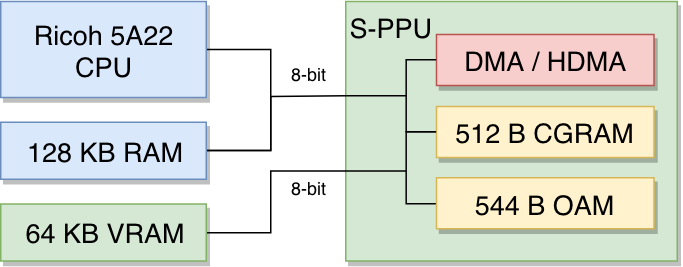
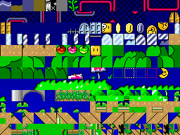

# Super Nintendo Architecture

[Super Nintendo Architecture](https://www.copetti.org/writings/consoles/super-nintendo/)を翻訳したもの

## 📌 導入

任天堂は、高価な既製品を使わずに、次世代のグラフィックとサウンドを実現しました。

そのため、スーパーファミコンは拡張性を重視した設計になっています。

CPUが光速で進化していく中で、任天堂がゲーム機を輝かせるためには、ゲームカートリッジによる拡張性が必要だったのです。

## ⚙️ CPU

メインプロセッサは、リコーの5A22です。これは、MOS Technology社の6502を16bit化したWestern 65C816をベースにしています。

スーファミはファミコンのCPUと基盤を共有しているので、もともとファミコンのゲームとの互換性を考えていた可能性が少しあります。

CPUは可変クロックを採用しており、レジスタ操作時には最大3.58MHz、低速の外部バス（シリアル/コントローラポート）へのアクセス時には1.79MHzになります。

### 5A22の特徴

- 65816 ISA: オリジナルの6502 ISAを拡張した16bit命令セットですが、ファミコンゲームが使用していた未定義の命令は実装されていません。
- 16bitレジスタ: アキュムレータ（算術演算を行う場所）とインデックスレジスタ（メモリアドレスの計算に使用）は、16bitモードと8bitモードを切り替えることができます。
- リコーが新たに追加した16bitの乗算・除算ユニットにより、これらの演算をCPUがハードウェアで実行できるようになりました。（65C816には乗算・除算の専用命令はありません）
- 8bitの外部データバス: つまり、外部メモリ上で16bitのレジスタを移動させるのに、2倍のサイクルが必要になります。

### リコーによる改良

リコーは、レジスタの追加に加えて、CPUを介さずにメモリを移動させることができる2つの専用DMAをコア設計に組み込み、高速化を実現しました。

このアーキテクチャが機能するためには、次の2つの異なるアドレスバスを使ってメモリの領域を参照する必要があります。

- CPUが制御する24bitのAバス: カートリッジ、CPU、WRAMに接続されます。
- S-PPUが制御される8bitのBバス: カートリッジ、CPU、WRAM、S-PPU、オーディオCPUに接続されます。

DMAを設定する際、転送元のデータは転送先とは別のアドレスバスから来る必要があります。

ニーズに合わせて次の2種類のDMAのどちらかを選択できます。

- 汎用DMA: 任意のタイミングで転送を行いますが、転送が終了するまではCPUが停止してしまいます。
- HDMA: 各水平走査の後（CRTのビームが次の行を描く準備をしている間）に、小さな転送を実行します。これにより、CPUが長時間停止するのを避けることができます。転送量は1スキャンラインあたり4バイトに制限されます。

DMA転送を設定するためのチャンネルが8つ用意されており、独立した8つの転送を一度に行うことが可能です。

### セグメンテーションフォールト

SNESには、オープンバスと呼ばれる変わった特徴があります。

マッピングされていない/無効なアドレスから読み取ろうとする命令がある場合、代わりに最後に読み取った値が供給されます。（CPUはこの値をMDRと呼ばれるレジスタに格納します）

## 🖥 グラフィック

その前に、まず[NESの記事](https://www.copetti.org/writings/consoles/nes/)をお読みになることをお勧めします。この記事には、ここで再検討される有用なコンセプトが紹介されています。

### 設計

任天堂は、NESのアーキテクチャを改良し、2つの異なるPPUチップを使用して描画システムを構築しました。

2つのPPUを合わせて「Super PPU」または「S-PPU」と呼ばれています。

標準的な解像度は256x224です。PALシステムでは256×240で出力されますが、ほとんどのゲームでは新たに増えたピクセルを使用せず、レターボックス（黒い線）が表示されます。

S-PPUを構成する2つのPPUは異なる役割を果たすように設計されています。

- PPU1: タイルをレンダリングし、それに変換（回転、拡大縮小）を施す。
- PPU2: レンダリングされたグラフィックにウィンドウ、モザイク、フェードなどの特殊効果を施す。

プログラミング(ソフト開発)の観点からはPPUが分割されているということを意識する必要はなく、両チップは事実上1つのチップとして扱われます。

### メモリ

グラフィックのデータは、次の3つのメモリ領域に格納されています。

- VRAM: 64KBの領域で、背景レイヤーを構築するためのタイルやマップ（表）を格納します。
- CGRAM: 512Bの領域で、512個のカラーパレットエントリに対応し、各エントリのサイズはワード(16bit)です。
- OAM: 544Bの領域で、スプライトとして使用される128枚のタイルを参照するテーブルと、その属性が含まれています。

### 画面の構成要素

画面がどのようにレンダリングされるかを示すために、「スーパーマリオワールド」を使ってデモンストレーションを行います。

**タイル**

S-PPUは、NESのPPUと同様にタイルを用いて高度なグラフィックスを構築しますが、NESのPPUに比べて大幅に改善されています。

- ゲームカートリッジはPPUに直接接続されなくなったので、タイルは（セガのメガドライブのように）まずVRAMにコピーする必要があります。DMAはこのような場合に非常に便利です。
- タイルのサイズは従来の8x8ピクセルに限らず、16x16ピクセルにも対応しています。
- タイルをメモリに格納する際には、1ピクセルあたりに使用する色数に応じて圧縮されます。サイズの単位はbpp（bits per pixel）で、最小は2bpp（各ピクセルがメモリ上で2bitしか占有せず、4色しか使用できない）、最大は8bppで、バイト全体を必要とする代わりに256色を使用することができます。

**背景**

スーパーファミコンでは、最大で4種類の背景レイヤを生成することができます。

8x8または16x16のタイルを使用して、ブロックは最大32x32ピクセル（2x2タイル）になります。

つまり、各背景レイヤのサイズは、最大で1024x1024ピクセルの幅（32x32タイル）になります。

これらのレイヤーが構成されるVRAM上の領域はタイルマップと呼ばれ、テーブル（メモリ上の連続した値）として構成されています。

タイルマップの各エントリには、以下の属性があります。

- 水平/垂直方向に反転させるかのフラグ
- 優先度(0 or 1)
- CRAMのパレットの参照
- タイルの参照

これらの平面はスクロール可能ですが、利用できる機能（色、レイヤー数、独立したスクロール領域、選択範囲のサイズ）は、選択した背景モードによって異なります。

**モード**

**スプライト**

**結果**

