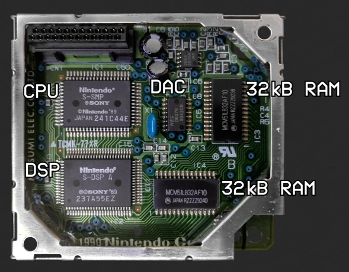

# サウンド

スーファミのAPU(SPUとも呼ばれる)は、ファミコンのそれと比べると大幅に進化しています。

サウンドデータ格納用として64KBのRAM(ARAM)が与えられていて、さらにはスーファミのメインCPUとは別のプロセッサ(SPC700)やDSP[1](#dsp)まで与えられています。

APUとスーファミ本体のCPUは、4つのポート(IOレジスタ)を介してのみデータのやり取りを行います。そのため、APUは非常に独立性が高く、APUだけ取り外してスーファミ音源の再生機器として利用する人も多いようです。

## 注釈

1: デジタルシグナルプロセッサ。CPUと違って、信号処理で非常に多く使われる積和演算が得意

## 参考

- [SPC700 & ARAM - Super Nintendo Entertainment System Features Pt. 10](https://youtu.be/n5eTOGZdnTU)
- [SNES Audio System Overview - SPC700 Series pt. 1](https://youtu.be/zrn0QavLMyo)
