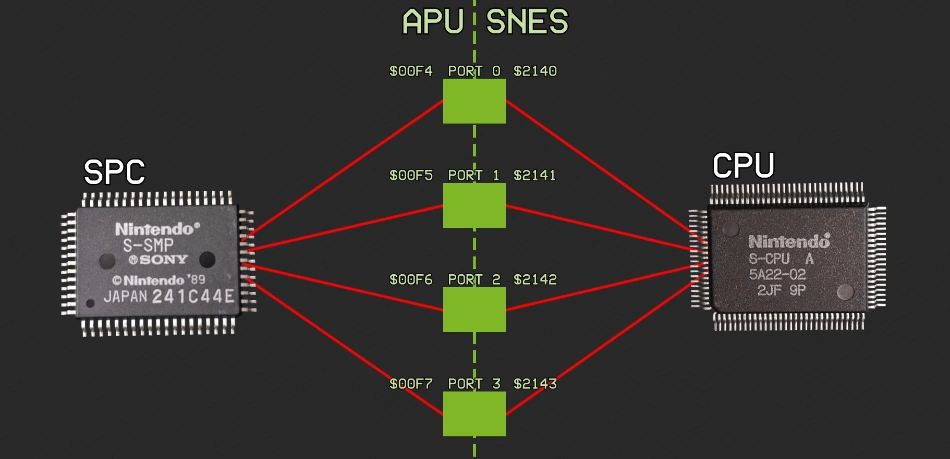

# IOレジスタ

スーファミ本体のCPUは、4つのIOレジスタ(8bit)を介して、APUとデータをやりとりしています。

## 214xh - APUI0x - APU通信レジスタx (R/W, x=0,1,2,3)

```
  Bit 0-7   データ
    CPU目線で見て
      Write: CPU -> APU
      Read:  APU -> CPU
```

内部的には、APU行きのデータと、APUからのデータで、合計2バイトのデータを保持しています。

これらのレジスタは8bitモードでのみ書き込んでください。

> **Note**  
> ハードウェアの不具合により、 `[2140h..2141h]` への16bit書き込みが `[2143h]` を破壊することがあります。 ただしこれはカートリッジにROMチップが多く、バスに過度の負荷がかかる場合など、特定の状況でのみ発生する可能性があります。

APU側からは、SPC(SPC700)のIOレジスタ、`CPUIOx`(`00F4..00F7h`)を通してこのレジスタにアクセスすることができます。



## Uploader

```c
  // 0x2140,2141 が 0xBBAA になるまで待つ
  WAIT(READ16(0x2140) == 0xBBAA);
  kick = 0xCC; // start-code for first command

  for (block = 1; block <= num_blocks ; block++) {
    STORE16(0x2142) = dest_addr; // usually 200h or higher (above stack and I/O ports)
    STORE8(0x2142) = 0x01; // command=transfer (can be any non-zero value)
    STORE8(0x2140) = kick; // start command (CCh on first block)
    WAIT(READ8(0x2140) == kick); // 0x2140 が kick になるまで待つ

    for (index = 0; index < length; i++) {
        READ8(0x2141) = BYTE(src_addr+index);  // send data byte
        READ8(0x2140) = LSB(index); // send index LSB (mark data available)
        WAIT(READ8(0x2140) != LSB(index)); // wait for acknowledge
    }

    kick = (index+2 & 0xFF) | 1;
  }

  WRITE8(0x2142, entry_point); // entrypoint, must be below FFC0h (ROM region)
  WRITE8(0x2141, 0x0); // command=entry (must be zero value)
  WRITE8(0x2140, kick); // start command
  WAIT(READ8(0x2140) == kick); // wait for acknowledge
```


