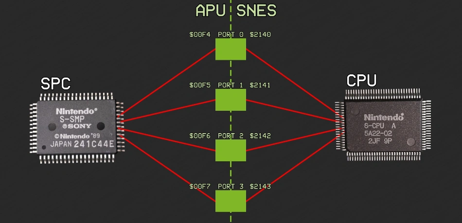

# IOレジスタ

アドレスは、SPC700のメモリ空間のものです。

## 00F0h - TEST - テストレジスタ (W)

プロセッサ自体の動作を変更します。

```
  Bit 0    Timer-Enable     (0=Normal, 1=Timers don't work)
  Bit 1    RAM Write Enable (0=Disable/Read-only, 1=Enable SPC700 & S-DSP writes)
  Bit 2    Crash SPC700     (0=Normal, 1=Crashes the CPU)
  Bit 3    Timer-Disable    (0=Timers don't work, 1=Normal)
  Bit 4-5  Waitstates on RAM Access         (0..3 = 0/1/4/9 cycles) (0=Normal)
  Bit 6-7  Waitstates on I/O and ROM Access (0..3 = 0/1/4/9 cycles) (0=Normal)
```

Default setting is 0Ah, software should never change this register. Normal memory access time is 1 cycle (adding 0/1/4/9 waits gives access times of 1/2/5/10 cycles). Using 4 or 9 waits doesn't work with some opcodes (0 or 1 waits seem to work stable).

Internal cycles (those that do not access RAM, ROM, nor I/O) are either using the RAM or I/O access time (see notes at bottom of this chapter).

## 00F1h - CONTROL - 制御レジスタ (W)

リセット時には `0xB0` になります。

```
  Bit 0-2  タイマー0~2有効化フラグ (0=無効, 1=有効)
    タイマーnを無効化した場合、TnOUTがゼロクリアされ、dividerがリロードされます。
  Bit 3    不使用
  Bit 4    00F4h/00F5hのSNESからの入力値をゼロクリアする (1にしてる間ずっと)
  Bit 5    00F6h/00F7hのSNESからの入力値をゼロクリアする (1にしてる間ずっと)
  Bit 6    不使用
  Bit 7    アドレス FFC0h-FFFFh からの読み取り時に何を返すか (0=ARAM, 1=ブートROM) (書き込みは常にARAM)
```

## 00F2h - DSPADDR - DSPレジスタ番号 (R/W)

```
  Bit 0-7  DSPレジスタ番号 (usually 00h..7Fh) (80h..FFh are read-only mirrors)
```

## 00F3h - DSPDATA - DSPレジスタデータ (R/W)

```
  Bit 0-7  DSPレジスタデータ (read/write the register selected via Port 00F2h)
```

## 00Fxh - CPUIOn - CPU通信レジスタn (R/W, n=0,1,2,3)

```
  00F4h - CPUIO0
  00F5h - CPUIO1
  00F6h - CPUIO2
  00F7h - CPUIO3
```

これらのレジスタはスーファミ本体のCPU(S-CPU)との通信に使用されます。

S-CPUへの出力ポート(書き込み専用)が4つ、S-CPUからの入力ポート(読み出し専用)が4つ、合計8つのレジスタがこの4つのアドレスでアクセスされます。

```
  Bit 0-7   データ
    APU(SPC700)目線で見て
      Write: APU   -> S-CPU
      Read:  S-CPU -> APU
```

S-CPU側からは、`APUIOx`(`2140..2143h`)を通してこのレジスタにアクセスすることができます。



If the SPC700 writes to an output port while the S-CPU is reading it, the S-CPU will read the logical OR of the old and new values. Possibly the same thing happens the other way around, but the details are unknown?

## 00Fxh - AUXIOn - 補助レジスタn (R/W, n=4,5)

```
  00F8h - AUXIO4 (S-SMP Pins 34-27)
  00F9h - AUXIO5 (S-SMP Pins 25-18)
```

SPC700の AUXIOn に割り当てられたピンは、スーファミの場合、何にも接続されていないため、レジスタは実質的に汎用レジスタのように機能し、自由に使うことが可能です。

```
  Bit 0-7  データ
```

## 00Fxh - TnDIV - Dividerレジスタn (W, n=0,1,2)

[タイマー](timer.md)のページを参照してください。

## 00Fxh - TnOUT - タイマーカウンタn (R, n=0,1,2)

[タイマー](timer.md)のページを参照してください。


