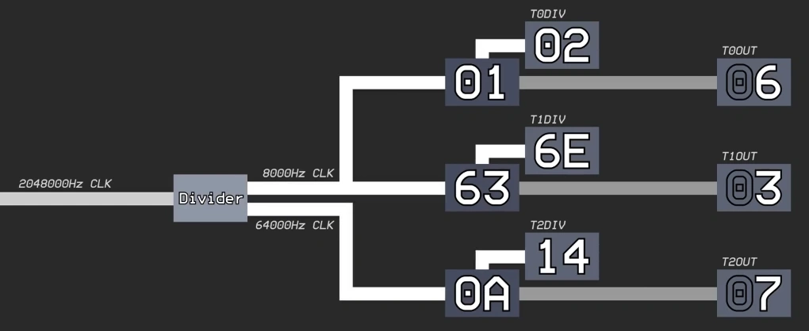

# タイマー

タイマーは、APUで実行されているプログラムが適切なタイミングで実行されるために必要なコンポーネントです。

スーファミ本体の場合は、NMIやブランク期間のような区切りがありますが、APUにはそのようなものが存在しないため、タイマーが必要になってきます。

APUはタイマーを3つ備えており、タイマー0,1,2と呼ばれます。

## 仕組み

DSPからSPC700には 2.048MHz のクロック信号が送られており、このクロックをマスタークロックとしてタイマーは機能します。( 1マスターサイクル= `1/(2048000)sec` )

タイマー0とタイマー1は、256マスターサイクルつまり、8KHzクロック信号を生成します。タイマー2は、32マスターサイクル、64KHzクロック信号を生成します。

各タイマーは、SPC700からは見えない内部カウンタを持っており、8KHz/64KHzクロック信号ごとにインクリメントされます。



## 00Fxh - TnDIV - Dividerレジスタn (W, n=0,1,2)

```
  00FAh/00FBh/00FCh - T0DIV/T1DIV/T2DIV
```

タイマーの内部カウンタが `TnDIV` の値と等しくなった場合に、内部カウンタを 0 にします。(その際に、`TnOUT` をインクリメント)

`TnDIV` に 0 を書き込んだ場合は、256 として扱われます。

## 00Fxh - TnOUT - タイマーカウンタn (R, n=0,1,2)

```
  00FDh/00FEh/00FFh - T0OUT/T1OUT/T2OUT
```

内部カウンタが、0になったときにインクリメントされます。

```
  Bit 0-3  現在のカウンタ値 (読み出すと0にリセットされます)
  Bit 4-7  不使用 (常に0)
```